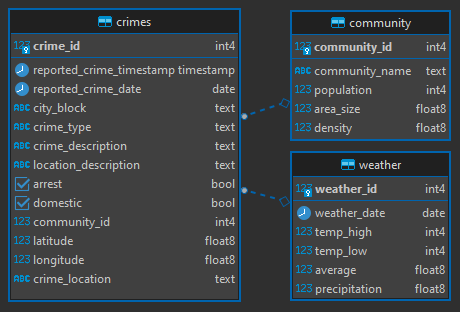

# Chicago Crime and Weather

**Author**: Jaime M. Shaker  
**Email**: jaime.m.shaker@gmail.com  
**Website**: https://www.shaker.dev  
**LinkedIn**: https://www.linkedin.com/in/jaime-shaker/   

:exclamation: If you find this repository helpful, please consider giving it a :star:. Thanks! :exclamation:

## Introduction
An SQL analysis of reported crimes in the city of Chicago and the average daily temperature between 2018 and 2022.

* [Data Analysis Question & Answers](./questions_and_answers.md)

## Datasets used
Seven key [datasets](./source_data/csv/) for this case study
- <strong>chicago_areas.csv</strong>: Chicago neighborhoods and areas.
- <strong>chicago_temps_18-22.csv</strong>: City Weather 2018-2022.
- <strong>chicago_crime_2018.csv</strong>: Reported crimes in 2018.
- <strong>chicago_crime_2019.csv</strong>: Reported crimes in 2019.
- <strong>chicago_crime_2020.csv</strong>: Reported crimes in 2020.
- <strong>chicago_crime_2021.csv</strong>: Reported crimes in 2021.
- <strong>chicago_crime_2022.csv</strong>: Reported crimes in 2022.

## Entity Relationship Diagram

:exclamation: If you find this repository helpful, please consider giving it a :star:. Thanks! :exclamation:

